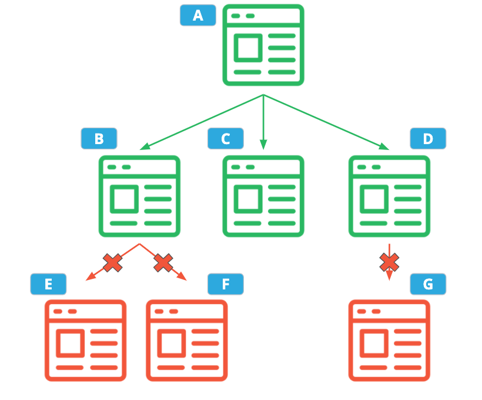

# Parallel Web Crawler Project

Project developed using **[Java SE 17](https://www.oracle.com/java/technologies/downloads/#java17)** and **[Maven 3.8.1](https://maven.apache.org/docs/3.8.1/release-notes.html)** for the **[Udacity Advanced Java Programming Techniques Course](https://www.udacity.com/course/advanced-java-programming-techniques--cd0381)**. 

This Parallel Web Crawler Application was upgrated from a legacy single-threaded web crawler to a multi-core architecture to increase crawler throughput. Furthermore, the performance of the crawler was measured to prove that, given the same amount of time, the multi-threaded implementation can visit more web pages than the legacy implementation. 

## Project Instructions

### Step 1. Crawler Configuration

The web crawler app reads in a JSON file to determine how it should run. Let's look an example of such a file:

#### JSON Configuration Example

```
{
  "startPages": ["http://example.com", "http://example.com/foo"],
  "ignoredUrls": ["http://example\\.com/.*"],
  "ignoredWords": ["^.{1,3}$"],
  "parallelism": 4,
  "implementationOverride": "com.udacity.webcrawler.SequentialWebCrawler",
  "maxDepth": 10,
  "timeoutSeconds": 7,
  "popularWordCount": 3,
  "profileOutputPath": "profileData.txt"
  "resultPath": "crawlResults.json"
}
```
  * `startPages` - These URLs are the starting point of the web crawl.
  
  * `ignoredUrls` - A list of regular expressions defining which, if any, URLs should not be followed by the web crawler. In this example, the second starting page will be ignored.
  
  * `ignoredWords` - A list of regular expressions defining which words, if any, should not be counted toward the popular word count. In this example, words with 3 or fewer characters are ignored.
  
  * `parallelism` - The desired parallelism that should be used for the web crawl. If set to 1, the legacy crawler should be used. If less than 1, parallelism should default to the number of cores on the system.
  
  * `implementationOverride` - An explicit override for which web crawler implementation should be used for this crawl. In this example, the legacy crawler will always be used, regardless of the value of the "parallelism" option.

  If this option is empty or unset, the "parallelism" option will be used (instead of the "implementationOverride" option) to determine which crawler to use. If this option is set to a non-empty string that is not the fully-qualified name of a class that implements the `WebCrawler` interface, the crawler will immediately fail.
  
  * `maxDepth` - The max depth of the crawl. The "depth" of a crawl is the maximum number of links the crawler is allowed to follow from the starting pages before it must stop. This option can be used to limit how far the crawler drifts from the starting URLs, or can be set to a very high number if that doesn't matter.
  
       *Example*: Suppose your starting page "A", links to the following web pages, and you want to run with a depth of 2.
       


In This Example, the Crawler Would Only Visit Pages A, B, C, and D

* `timeoutSeconds` - The max amount of time the crawler is allowed to run, in seconds. Once this amount of time has been reached, the crawler will finish processing any HTML it has already downloaded, but it is not allowed to download any more HTML or follow any more hyperlinks.
  
* `popularWordCount` - The number of popular words to record in the output. In this example, the 3 most frequent words will be recorded. If there is a tie in the top 3, word length is used as a tiebreaker, with longer words taking preference. If the words are the same length, words that come first alphabetically get ranked higher.
  
* `profileOutputPath` - Path to the output file where performance data for this web crawl should be 
. If there is already a file at that path, the new data should be appended. If this option is empty or unset, the profile data should be printed to standard output.
  
* `resultPath` - Path where the web crawl result JSON should be written. If a file already exists at that path, it should be overwritten. If this option is empty or unset, the result should be printed to standard output.

### Crawler Configuration Implementation

In this step, I read the configuration file that is in the `com.udacity.webcrawler.json` package. In fact, a Java representation of the configuration, `CrawlerConfiguration`, has already been implemented!

My task was to fill in the `src/main/java/com/udacity/webcrawler/json/ConfigurationLoader.java` file:

  * `public static CrawlerConfiguration read(Reader reader)` - First Implementation.
  
  The `reader` parameter contains JSON input. My `read(Reader reader)` method should read the JSON input and parse it into a `CrawlerConfiguration` using the Jackson JSON library. 

  First, I "told" Jackson that `CrawlerConfiguration` uses the builder pattern by annotating the `CrawlerConfiguration` class with the `@JsonDeserialize` annotation:

        @JsonDeserialize(builder = CrawlerConfiguration.Builder.class)
        public final class CrawlerConfiguration {
          ...

  Next, I defined the mapping between JSON property names and builder methods by annotating each of the builder's setter methods with `@JsonProperty`. For example:

        @JsonProperty("startPages")
        public Builder addStartPages(String... startPages) {
          ...

  Finally, I implemented `CrawlerConfiguration#read(Reader)` by creating a new `com.fasterxml.jackson.databind.ObjectMapper` and calling `ObjectMapper#readValue`.
  
  * `public CrawlerConfiguration load()` - Implemented this next.
  
  My `load()` method will read the JSON string from a file `Path` which has already been provided to the `ConfigurationLoader` constructor. Pass that string to the `read(Reader reader)` and return the created `CrawlerConfiguration`.
Finally, make sure the configuration unit tests pass by running them in the terminal:

```
mvn test -Dtest=ConfigurationLoaderTest
```

*Hint*: If you get a "Stream closed" failure in the test, try calling `ObjectMapper#disable(Feature)` to disable the `com.fasterxml.jackson.core.JsonParser.Feature.AUTO_CLOSE_SOURCE`. This prevents the Jackson library from closing the input `Reader`, which you should have already closed in `ConfigurationLoader#load()`.

## Step 2. Crawler Output

Now the crawler can load its configuration and run, but it does not know how to tell you about its results. Let's fix that!

So, I printed the results to a JSON file using this format:

### Example JSON Output

```
{
  "wordCounts": {
    "foo": 54,
    "bar": 23,
    "baz": 14
  },
  "urlsVisited": 12 
}
```
  * `wordCounts` - The mapping of popular words. Each key is a word that was encountered during the web crawl, and each value is the total number of times a word was seen.
     
    When computing these counts for a given crawl, results from the same page are _never_ counted twice.
    
    The size of the returned map should be the same as the "popularWordCount" option in the crawler configuration. For example,  if "popularWordCount" is 3, only the top 3 most frequent words are returned.
     
    The keys and values should be sorted so that the more frequent words come first. If multiple words have the same frequency, prefer longer words rank higher. If multiple words have the same frequency and length, use alphabetical order to break ties (the word that comes first in the alphabet ranks higher). You can use the existing `Comparator` class in `src/main/java/com/udacity/webcrawler/WordCounts.java` to do this.
  
  * `urlsVisited` - The number of distinct URLs the web crawler visited.
                  
    A URL is considered "visited" if the web crawler attempted to crawl that URL, even if the HTTP request to download the page returned an error.
                    
    When computing this value for a given crawl, the same URL is never counted twice.

### Implementing Crawler Output

Now, it's time to fill in `src/main/java/com/udacity/webcrawler/json/CrawlResultWriter.java`. This should feel similar to the last step, but this time I was writing to a file (or a `Writer`) instead of reading. Just like for the `ConfigurationLoader`, I used a `ObjectMapper` from the Jackson library, but this time calling the `ObjectMapper#writeValue` method.

After I done, I makeed sure the tests pass:

```
mvn test -Dtest=CrawlResultWriterTest
```

*Hint*: If a test fails due to a Stream being closed twice, try calling `ObjectMapper#disable(Feature)` with the `com.fasterxml.jackson.core.JsonGenerator.Feature.AUTO_CLOSE_TARGET` feature. This will prevent Jackson from closing the `Writer` in `CrawlResultWriter#write(Writer)`, since you should have already closed it in `CrawlResultWriter#write(Path)`.

### Step 3. Running the Legacy Crawler

Before we run the crawler, let's make sure it can write its results so that we can see it working!

First, I found the "main" program file at `src/main/java/com/udacity/webcrawler/main/WebCrawlerMain.java`. I found two `TODO`s there: one for writing the crawl output, and one for writing the profile output.

I completed the first `TODO` using the output path stored in the `config` field. You used the `CrawlResultWriter` class that I just wrote. Create an instance of `CrawlResultWriter` by passing in the `CrawlResult` (the code that creates the `CrawlResult` is already written).

Next, I checked the value of `config.getResultPath()`. If it's a non-empty string, create a `Path` using `config.getResultPath()` as the file name, then pass that `Path` to the `CrawlResultWriter#write(Path)` method.

Alternatively, if the value of `config.getResultPath()` is empty, the results should be printed to standard output (also known as `System.out`).

*Hint*: There _may_ be a standard `Writer` implementation in `java.io` (&ast;*cough*&ast; [`OutputStreamWriter`](https://docs.oracle.com/javase/10/docs/api/java/io/OutputStreamWriter.html) &ast;*cough*&ast;) that converts `System.out` into a `Writer` that can be passed to `CrawlResultWriter#write(Writer)`.

Next, I builded the project (skipping tests, since they shouldn't all pass yet):

```
mvn package -Dmaven.test.skip=true
```

Finally, I runned the legacy crawler using the sample configuration file included with the project:

```
java -classpath target/udacity-webcrawler-1.0.jar \
    com.udacity.webcrawler.main.WebCrawlerMain \
    src/main/config/sample_config_sequential.json
```

### Step 4. Coding the Parallel Web Crawler

Luckily for me, the forward-thinking author of the legacy web crawler created an extensible design that uses a dependency injection framework. They defined an interface `WebCrawler`; the legacy code exists in the concrete implementation `SequentialWebCrawler`. Definitely not the worst legacy code I've ever seen! All I had to do was to create a second implementation, `ParallelWebCrawler`, that has the same functionality as the legacy crawler, but takes advantage of multi-core architectures.

My task was to fill in the `src/main/java/com/udacity/webcrawler/ParallelWebCrawler.java` file. Specifically the `crawl` method:

`public CrawlResult crawl(List<String> startingUrls)`
  
The input is a list of URLs where the crawl should start downloading and parsing HTML. For this part, I coud reuse the legacy code that downloads and parses web pages. `@Inject` a `com.udacity.webcrawler.parser.PageParserFactory`, and used it like this:

```
PageParser.Result result = parserFactory.get(url).parse();
```

The implementation of `ParallelWebCrawler` must actually run in parallel. A [`ForkJoinPool`](https://docs.oracle.com/javase/10/docs/api/java/util/concurrent/ForkJoinPool.html) has already been created for me in the `ParallelWebCrawler` constructor.

Recall that `ForkJoinPool` is a kind of [`Executor`](https://docs.oracle.com/javase/10/docs/api/java/util/concurrent/Executor.html) that is optimized for efficient processing when most work tasks create other subtasks. In other words, it is ideal for building _recursive_ algorithms that run in parallel. In fact, the most common kinds of subtasks are called [`RecursiveAction`](https://docs.oracle.com/javase/10/docs/api/java/util/concurrent/RecursiveAction.html) and [`RecursiveTask`](https://docs.oracle.com/javase/10/docs/api/java/util/concurrent/RecursiveTask.html). I took a look at the legacy implementation (`src/main/java/com/udacity/webcrawler/SequentialWebCrawler.java`), and you noticed that also uses a _recursive_ algorithm because the `crawlInternal()` method invokes itself. So, I had to think about ways to take this recursive algorithm and use `ForkJoinPool` to make it parallel.

There are multiple correct ways to do this. For starters, maybe the way is to create an own custom task class, which should be a subclass of `RecursiveAction` or `RecursiveTask` — either choice is fine, but depending on the decision the final code will be slightly different. Each custom task will download and process URLs in a separate thread. Remember how `ForkJoinPool` works by having its subtasks create more subtasks? To do that, my custom task class will create other subtasks and run them using the static [`invoke`](https://docs.oracle.com/javase/10/docs/api/java/util/concurrent/ForkJoinTask.html#invoke()) or [`invokeAll`](https://docs.oracle.com/javase/10/docs/api/java/util/concurrent/ForkJoinTask.html#invokeAll()) methods.

**Hint:** If it makes sense for the way implementation is structured, you should consider applying the factory pattern to create these subtasks. You should aim to minimize the presence of large constructor calls with long lists of parameters; the builder pattern can help with this.

Remember that in a parallel program, there maybe multiple threads accessing data structures at the same time. Because of this, I shoulded use one or more concurrent data structures to compute the output with the following tips in mind:

  * For the `urlsVisited` output, the same URL should not be counted twice in the same crawl. *Note*: if a URL returns an HTTP error (such as a 400 error), the crawler still considers that as a "visit".

  * When computing the `wordCounts`, the crawler should not accidentally count the results from the same page twice. Remember that the crawler will be downloading and processing multiple web pages at the same time, so this could be tricky!

    Utilities like [`Collections.synchronizedCollection`](https://docs.oracle.com/javase/10/docs/api/java/util/Collections.html) and [`java.util.concurrent`](https://docs.oracle.com/javase/10/docs/api/java/util/concurrent/package-summary.html) will be helpful, but when using these data structures, think carefully about which methods are and are not atomic, and what guarantees those methods provide.

#### Running Tests

As I worked, I runned the provided unit tests on my parallel web crawler implementation:

```
mvn test -Dtest=WebCrawlerTest,ParallelWebCrawlerTest
```

These tests do not thoroughly test that the crawler uses correct synchronization, but they will provide a useful signal as to whether `ParallelWebCrawler` provides the same functionality as the legacy code. You will need to look over your implementation to ensure it uses correct synchronization.

### Step 5. Fun with Functional Word Counting

I needed to implement the final word count sorting using _only_ functional programming techniques.

I openned the utility class `src/main/java/com/udacity/webcrawler/WordCounts.java` and you noticed it was written when Java 7 was the hot new thing. As it was a legacy code I made updates to take advantage of the newer functional programming features of Java!

There was just one non-`private` method:

```
static Map<String, Integer> sort(Map<String, Integer> wordCounts, int popularWordCount)
```

The input to this method is a `Map` of _all_ the words and counts your crawler encountered, and a number `popularWordCount` which is a copy of the value of the `popularWordCount` option from the JSON crawl configuration.

Your new `sort` method must return a new `Map` that contains up to `popularWordCount` entries from the original map, but sorted according to the following specification (which should look familiar):

  * The keys and values should be sorted so that the more frequent words come first. If multiple words have the same frequency, prefer longer words rank higher. If multiple words have the same frequency and length, use alphabetical order to break ties (the word that comes first in the alphabet ranks higher).

But wait, what exactly does it mean to use **only functional programming techniques**? Simple: Don't use any `for` loops. That's right, no `for` loops at all. Instead, you will have to process the `wordCounts` map using only the Java `Stream` API, lambdas, and method references. The new method should be a single `return` statement with a "chain" of `Stream` operations. You _are_ allowed to reuse the `WordCountComparator` class.

*Hint*: To get started, turn `wordCounts` into a `Stream`. My method shoulded start like this: `return wordCounts.entrySet().stream()…`.

Recall that the order of the returned map is important, so I shouldedc take that into account when choosing a [`Collector`](https://docs.oracle.com/javase/10/docs/api/java/util/stream/Collectors.html) to terminate the `Stream`.

When I was done, I checked my code against the unit tests:

```
mvn test -Dtest=WordCountsTest
```

### Step 6. Performance Profiler

It's not enough just to have a new web crawler — you need to understand how its performance stacks up against the legacy code. How else will you be able to prove your implementation is better? Time is money, and cutting costs is a sure way to make a good impression. To do this, you will implement a basic method profiler.

What is a method profiler, you ask? It is a utility that writes down how long method calls took to complete during a particular run of the program. Profilers can get *really* fancy, but in this case you will be implementing a relatively simple one that writes to a text file like this:

```
Run at Fri, 18 Sep 2020 02:04:26 GMT
com.udacity.webcrawler.ParallelWebCrawler#crawl took 0m 1s 318ms
com.udacity.webcrawler.parser.PageParserImpl#parse took 0m 2s 18ms
```

#### Implementing the Profiler

Everything I needed was in the `src/main/java/com/udacity/webcrawler/profiler/` folder.

The profiler will record the running times of different method invocations. Now that the crawler runs in parallel, this could happen concurrently from multiple different threads. The `ProfilingState` class has already been implemented for you to be thread-safe.

I wrote a method interceptor that intercepts method calls annotated with the `@Profiled` annotation. To create classes whose methods are intercepted, I implemented the `Profiler` utility class. This class "wrap" the to-be-profiled objects in a dynamic proxy instance.

Implementation included the following steps:

  * Fill in `ProfilerImpl.java`. Reading Java's [`Proxy`](https://docs.oracle.com/javase/10/docs/api/java/lang/reflect/Proxy.html) documentation will be very helpful.

  * Fill in `ProfilingMethodInterceptor.java`. The `invoke` method should check whether the passed `Method` is annotated with `@Profiled`. If the method has the annotation, the interceptor should use the injected `java.time.Clock` to measure the duration of the method invocation, and then record it to the `ProfilingState`.
  
My interceptor should always return the same value (or throw the same `Throwable`) as the method that was intercepted. When implementing this, there are some common "gotchas" to look out for:

  * Think carefully about how the proxy should behave for the `java.lang.Object#equals(Object)` method. Reading the [`InvocationHandler`](https://docs.oracle.com/javase/10/docs/api/java/lang/reflect/InvocationHandler.html) documentation will be very helpful.

  * Special care should be taken to correctly handle exceptions thrown by the intercepted method. If the intercepted method throws something, the proxy should always throw the exact same thing. Make sure your proxy doesn't accidentally throw a [`UndeclaredThrowableException`](https://docs.oracle.com/javase/10/docs/api/java/lang/reflect/UndeclaredThrowableException.html) instead. Also remember that, even if it throws an exception, any `@Profiled` method should still have its running time recorded!

(*Note*: Due to limitations of the Java language, objects must be manually "wrapped" (using `Profiler.java`) to be profiled. The starter code already does this for you! Thanks, dependency injection! More sophisticated AOP frameworks sometimes use bytecode generation to avoid this kind of boilerplate.)

Once I was done, I runned the unit tests to check my work:

```
mvn test -Dtest=ProfilerImplTest
```

If I have been following the instructions in order and have already implemented the web crawler, I should now be able to run all the tests at once to make sure they pass:

```
mvn test
```

##### Output

Finally, the profile data should be written to a file defined by the `profileOutputPath` in the crawl configuration. Locate the final `TODO` in `WebCrawlerMain.java` and take care of it. The code for this should be very similar to the code you wrote for the crawl result file, but this time use the `profileOutputPath` for the file name.

##### (Optional) Profiler Enhancements

If you want to make your profiler stand out (and also be significantly more useful), try enhancing it in the following ways:

  * In addition to the basic information it already records, have the compiler also record the thread ID of the thread in which the method invocation happened.

  * Make it remember and record the number of times a particular method was called. 
  
### Step 7. Run the Parallel Crawler!

That's it!! I implemented an entire parallel web crawler, complete with performance profiling! I should now be able to run it with the following commands:

```
mvn package
java -classpath target/udacity-webcrawler-1.0.jar \
    com.udacity.webcrawler.main.WebCrawlerMain \
    src/main/config/sample_config.json
```

Try changing the starting pages in `src/main/config/sample_config.json` and see what different results you get!

                  
## Built With

Third-party Java libraries uded:

* [jsoup](https://jsoup.org/) - An open-source Java library for working with HTML.
  * License: [MIT License](https://jsoup.org/license)
* [Jackson Project](https://github.com/FasterXML/jackson) - Affectionately known as "the best JSON parser for Java".
  * License: [Apache 2.0](https://github.com/FasterXML/jackson-core/blob/master/src/main/resources/META-INF/LICENSE)
* [Guice](https://github.com/google/guice/) - An open-source dependency injection framework for Java.
  * License: [Apache 2.0](https://github.com/google/guice/blob/master/COPYING)
* [Maven](https://maven.apache.org/) - Used to build and manage the project dependencies.
  * License: [Apache 2.0 ](http://maven.apache.org/ref/3.0/license.html)
* [JUnit 5](https://junit.org/junit5/) - An open-source unit testing framework for Java.
  * License: [Eclipse Public License 2.0](https://github.com/junit-team/junit5/blob/main/LICENSE.md)
* [Truth](https://github.com/google/truth) - An open-source assertion framework used in Java unit tests.
  * License: [Apache 2.0](https://github.com/google/truth/blob/master/LICENSE)
